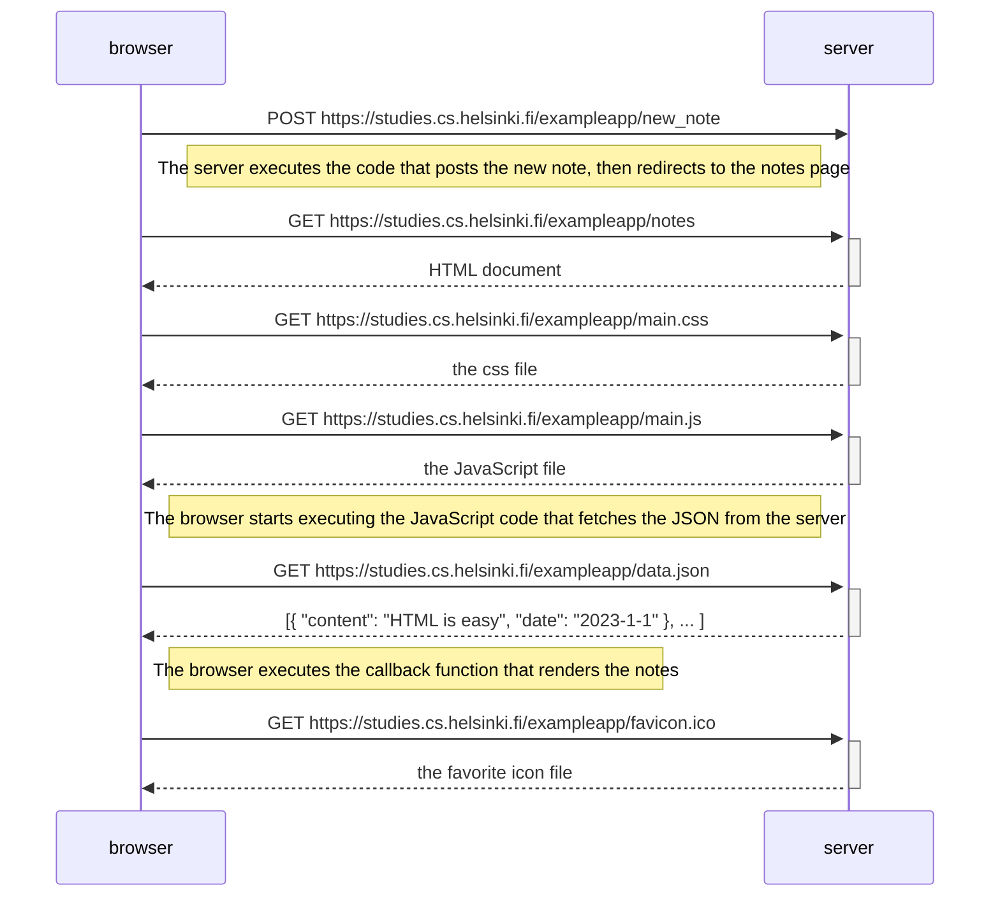
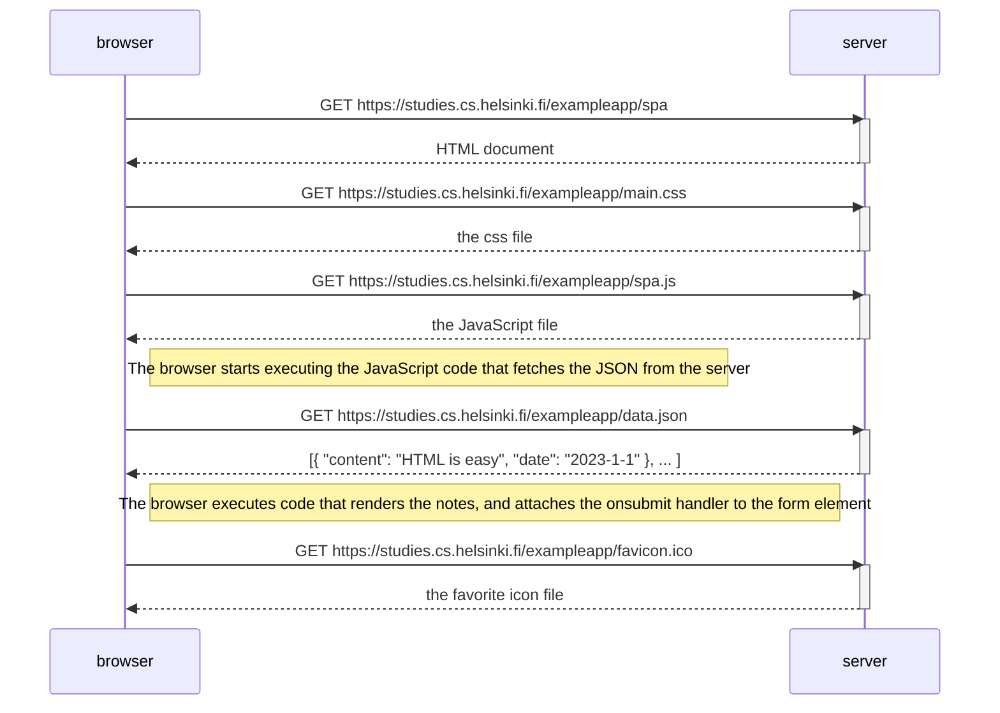
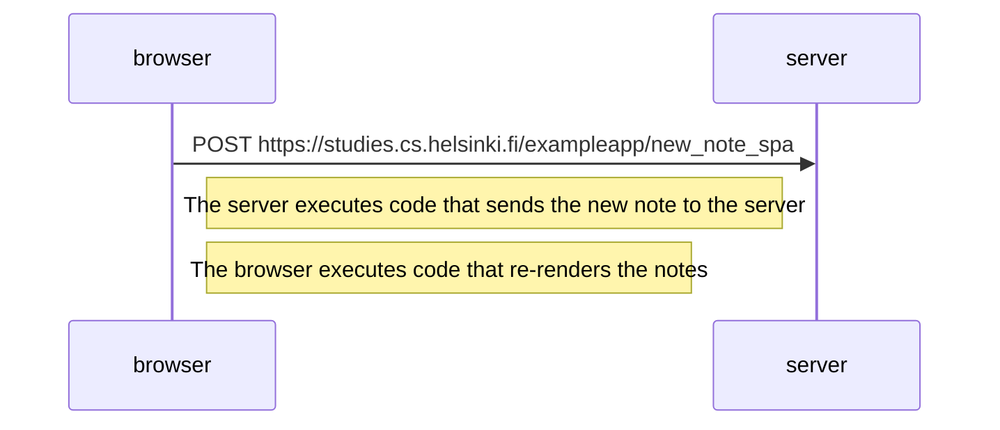

# Exercise 0.4: New note diagram
This is what happens when the user writes a new note and clicks on "Save" on this page:\
https://studies.cs.helsinki.fi/exampleapp/notes

# Exercise 0.5: Single page app diagram
This is what happens when the user navigates to the single page app page:\
https://studies.cs.helsinki.fi/exampleapp/spa

# Exercise 0.6: Single page app new note diagram
This is what happens when the user submits a new note on the single page app:\
https://studies.cs.helsinki.fi/exampleapp/spa

